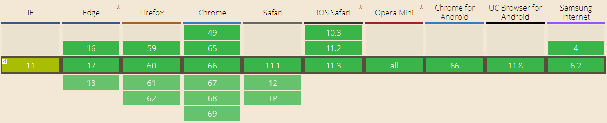
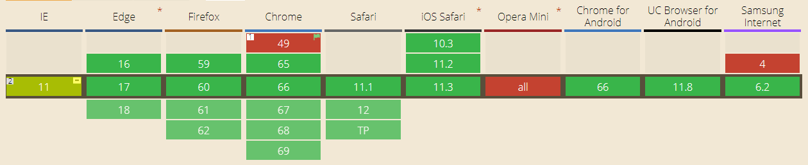
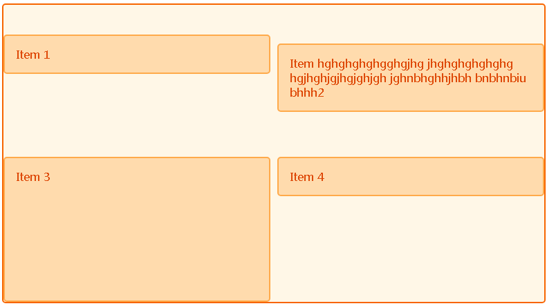
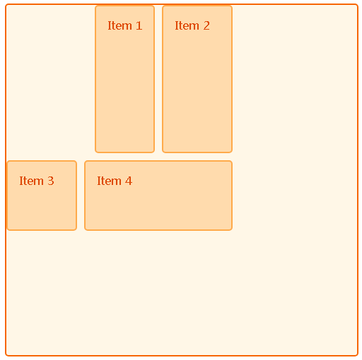
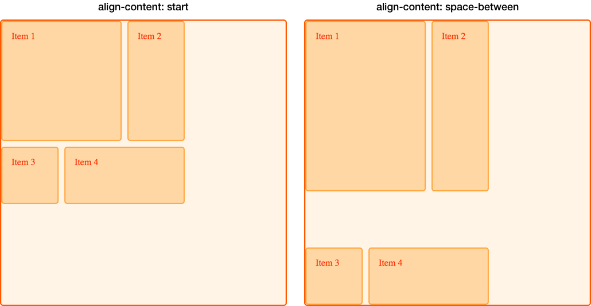
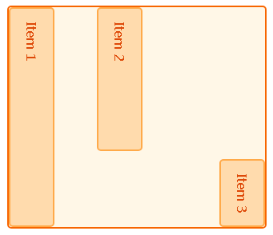

# CSS NOTE

## CSS层叠上下文（参考张鑫旭博客）
* z-index与层叠水平的区别: z-index可以影响*定位元素*以及*flex盒子的孩子元素*层叠水平，而层叠水平是每个元素都存在的。
* CSS2的层叠规则
    层叠上下文（backgroud/border）-> 负z-index -> block水平盒子 -> float浮动盒子 -> inline/inline-block水平盒子 -> z-index auto或0层叠上下文元素 -> 正z-index
* 层叠准则
    - 有明显的层叠水平的标志，如z-index，根据层叠标志判断
    - 当元素的层叠水平一致时，层叠顺序相同的时候，在DOM流中处于后面的元素会覆盖前面的元素
* 层叠上下文
    - 创建独立上下文的方式：1.根元素；2.z-index不为auto的定位元素（webkit内核浏览器当position:fixed天然拥有层叠上下文）；3.设置其他CSS3属性
* CSS3与层叠上下文
    - flex元素：（子元素）创建层叠上下文的条件满足两个条件：1.父元素设置为display:flex或index-flex；2.子元素的z-index不是auto。
    
            

                

                    <!--图片将在色块上层，因为色块是层叠上下文元素 -->
                    
                

            

            .box { display: flex; }
            .box > div { 
                background-color: blue;
                z-index: 1;
            }
            .box > div > img {
                position: relative;
                z-index: -1;
                right: -150px;
            }

    - opacity：透明元素具有层叠上下文
    - transform：应用了transform变换的元素具有层叠上下文
    - mix-blend-mode（混合模式，IE尚不支持）：应用了混合模式的元素具有层叠上下文
    - filter（CSS3的规范，与旧IE属性相异）：应用了filter的元素具有层叠上下文
    - isolation（隔离混合模式）：isolation:isolate;也会创建层叠上下文
        
            
            

                
            

            .mode {
                position: absolute;
                mix-blend-mode: dakren;
            }
            .box {
                background-color: blue;
                isolation: isolation;
            }
            .box > img {
                position: relative;
                z-index: -1;
            }

    - will-change：应用will-change优化的元素具有层叠上下文

## will-change(web draf)（参见MDN）
该属性将提示浏览器元素将如何变化，以便浏览器可以在元素实际改动之前设置合适的优化方案。will-change能够提升页面的响应及渲染性能。

        /* Keyword values */
        will-change: auto;
        will-change: scroll-position;
        will-change: contents;
        will-change: transform;     /* Example of <custom-ident> */
        will-change: opacity;       /* Example of <custom-ident> */
        will-change: left, top;     /* Example of two <animateable-feature> */

        /* Global values */
        will-change: inherit;
        will-change: initial;
        will-change: unset;

### 语法
* auto：无任何意图，保持正常的优化方案
* scroll-position：表示元素将进行与滚动位置有关的动画或改变
* contents：表示元素内容将会进行改变或有动画
* <custom-ident>：表示元素的某属性将会改变或动画。如果给定的属性是个缩写，将适用到所有与该缩写拓展成的属性。同时不能是以下值：unset、initial、inherit、will-change、auto、scroll-position、contents
* <animateable-feature>：可动画的特征，如left、top、opacity、transform等

### 适用注意事项
* 不要应用于过多的元素：不要滥用will-change，浏览器已经尽可能地优化所有东西。will-change将会使用一些机器资源来强化一些优化。滥用will-change将会导致页面缓慢或者消费过多的资源。
* 节制使用：直接在元素的stylesheet中加入will-change将会导致浏览器会持续优化。所以will-change都在一些条件下移除添加
* 不为了过剩的优化而使用：若页面已经表现流畅，不要为了一点点的加速而使用will-change
* 给予其充分的作用时间：浏览器需要时间来进行一些前置优化

## CSS变量（参见ruanyifeng）
* 声明：声明变量的时候，变量名前面加"--"，且变量名大小写敏感
    
        body { 
            --foo: #7f833f;
        }

        :root {
            --main-color: #4d4e53;
            --main-bg: rgb(225, 255, 255);
            --header-height: 68px;
            --content-padding: 10px 20px;
            --base-line-height: 1.4;
            --external-link: "external link";
        }

* var()函数：var(variable, defaultVal)用于读取变量，若读取不到则使用默认值。
    - 第二个参数不处理内部的逗号及空格，这些都将视为参数的一部分
    - var函数可以用在变量的声明中
    - 变量值只能作为属性值，不能作为属性名
    - 
* 变量规则：
    - 变量值为字符串时，可以与其他字符串拼接

        --bar: 'hello';
        --foo: var(--bar)' world';

    - 变量值为数值时，不能与数值单位拼接
    - 变量值带有单位时，不能写成字符串
* 作用域：同个变量可在多个选择器内声明，读取变量值是，选取优先级最高的声明，与层叠规则一致
    
            

            
Blue

            
Green

            
Red

以上可见变量的作用域就是它所在的选择器的有效范围。所以通常将全局变量放在根元素:root里面，以便任何选择器都可以读取它们。

* 兼容性处理：
    - CSS可以用@supports检测

        @supports (--a: 0) {
            /* supported */
        }

        @supports (not (--a: 0)) {
            /* not support */
        }

    - JS检测

            const isSupported = 
                window.CSS &&
                window.CSS.supports &&
                window.CSS.supports('--a', 0)

* JS操作CSS变量
    
        document.body.style.setProperty("--primary", "#ffffff");
        document.body.style.getPropertyValue("--primary");
        document.body.style.removeProperty("--primary");

        /* 特殊用法 */
        --foo: if (x>5) this.width = 10;  /*CSS无效，但可以被JS读取*/

## 垂直对齐
### line-height（文本行极限之间的距离）
行间距 = line-height - font-size。

    +—————————————————————————————————————————————————————————————————————————+
            应用范围： 所有元素
            继承性： 继承
            百分数：相对于元素的字体大小 
    +—————————————————————————————————————————————————————————————————————————+ 

当line-height为百分数或长度时，继承的是计算值。当指定为数值（缩放因子）时，继承的是值而不是计算值。

文本行的构造:

1. 文本行的元素生成一个内容区域，其大小由font-size确定。而内容区域则会生成一个行内框。
2. 内容区域的上（下）额外空间 = line-height与font-size的差值 / 2。行内框高度 = 额外空间 + 内容区域高度。

*NOTE:* 当应用到块级元素时，line-height定义了元素中文本基线之间的*最小距离*。
### vertical-align

    +—————————————————————————————————————————————————————————————————————————+
            值： baseline | sub | super | top | middle | bottom |
                text-bottom | <percentage> | <length> | inherit
            应用范围： 行内元素和表格的单元格
            继承性： 无
            百分数： 相对于元素的line-height值
    +—————————————————————————————————————————————————————————————————————————+

* baseline: 元素的基线与父元素的基线对齐。*若该元素没有基线，如图像或表单输入元素或是其他替换元素，那么该元素的底端与其父元素的基线对齐。*
* bottom：元素的行内框的底端与行框的底端对齐。
* text-bottom：元素的行内框底端与父元素的内容区域底端对齐。替换元素将忽略该值。
* middle：元素的行内框的中点与父元素基线上方的0.5ex（大多用户代理把1ex处理成0.5em）处的一个点对齐。

## 文本
* text-shadow(文本阴影)：
    
        +—————————————————————————————————————————————————————————————————————+
                值： none | [<color> || <length><length><length>?,]*
                    [<color> || <length><length><length>?]
                应用范围： 所有元素
                继承性： 无
        +—————————————————————————————————————————————————————————————————————+

前两个长度定义偏移距离，第三个长度定义阴影的模糊半径。

* white-space

        +—————————————————————————————————————————————————————————————————————+
                值： normal | nowrap | pre | pre-wrap | pre-line | inherit
                应用范围： 所有元素
                继承性： 无
        +—————————————————————————————————————————————————————————————————————+

|    值    | 空白符 | 换行符 | 自动换行 |
|   ----   |  ----- | - ---- |  ------- |
| pre-line | 合并   | 保留   | 允许     |
| normal   | 合并   | 忽略   | 允许     |
| nowrap   | 合并   | 忽略   | 不允许   |
| pre      | 保留   | 保留   | 不允许   |
| pre-wrap | 保留   | 保留   | 允许     |

* 文本方向（direction和unicode-bidi）

### 文本书写模式
* wirting-mode: 该属性定义文本的放置的方向是垂直还是水平，同时也能确定块元素拓展的方向。

        +—————————————————————————————————————————————————————————————————————+
                值： horizontal-tb(默认) | vertical-rl | vertical-lr |
                 sideways-rl(实验) | sideways-lr(实验)
                应用范围： 除表格行列、行组(row groups)、列组(column groups)
                外的所有元素
                继承性： 继承
        +—————————————————————————————————————————————————————————————————————+

## FLEXBOX
### 概念
css弹性布局是一种针对用户界面设计而优化的CSS盒子模型。
* 容器：盒模型设置为flexbox的元素（display: flex或inline-flex）;
* 主轴与交叉轴：主轴与交叉轴垂直相交，是容器存在的两个轴线；
* 项目默认沿主轴排列，单个项目占据的主轴空间称为main size，占据的交叉轴空间称为cross size;
* 弹性盒子模型使用逻辑方向（与物理方向相对应），主轴开始与结束同书写模式有关。

下图为默认弹性盒子的属性及概念

*NOTE:*项目不会自动填充主轴空间但会收缩，在交叉轴上项目会填充空间
### 兼容性
标准语法的兼容性如下图：

三个阶段：1.display: box;(2009) 2.display: flexbox;(2011) 3.display: flex(当前标准)
使用兼容语法可以兼容到IE10及IE10以上

    .flex-container {
        display: -webkit-box;  /* 09版语法: Safari 3.1-6,  iOS 6-, Android browser, older WebKit browsers.  */
        display: -moz-box;    /* 09版语法: Firefox 19- (buggy but mostly works) */
        display: -ms-flexbox;  /* 混合版本语法: IE 10 */
        display: -webkit-flex;  /* 新版语法： Chrome 21+ */
        display: flex;       /* 新版语法： Opera 12.1, Firefox 22+ */
    }

    .flex-start {
        /* 09版语法 */
        -webkit-box-pack: start;
        -moz-box-pack: start;
        /* 混合版语法 */
        -ms-flex-pack: start;
        /* 新版语法 */
        justify-content: flex-start;
    }

    .align-items-start {
        /* 09版语法 */
        -webkit-box-align: start;
        -moz-box-align: start;
        /* 混合版语法 */
        -ms-flex-align: start;
        /* 新版语法 */
        align-items: flex-start;
    }

    .align-contengt-start {
        /* 混合版语法 */
        -ms-flex-line-pack: start;
        /* 新版语法 */
        -webkit-align-content: flex-start; /* safari */
        align-content: flex-start;
    }

### 容器属性
* 轴线方向：主轴方向由flex-direction定义, 有如下值
    
        +—————————————————————————————————————————————————————————————————————+
                值：row(默认) | row-reverse | column | column-reverse
                应用范围：弹性盒子
                继承性： 无
        +—————————————————————————————————————————————————————————————————————+

* 换行：设置flex-wrap为nowrap（默认）时不换行；设置为wrap且溢出时会换行；设置为wrap-reverse同样会换行，但cross-start和cross-end互换。
* 简写：flex-flow是flex-direction/flex-wrap的简写，决定项目整体如何排布；
* justify-content：定义主轴上的对齐方式，有如下值：

        +—————————————————————————————————————————————————————————————————————+
                值：flex-start(默认) | flex-end | space-between | space-around | space-evenly
                应用范围：弹性容器
                继承性： 无
        +—————————————————————————————————————————————————————————————————————+

    - flex-start，依据主轴起点放置
    - flex-end，依据主轴终点放置
    - center，将在主轴居中排列
    - space-between，将均分主轴多余空间，但两端项目与轴线起点终点无间隙
    - space-around，项目两端分配到一样的空间，包括两端，所以项目间的间隔将是两端项目与轴线起/终点的两倍
    - space-evenly（支持度较低），项目间隙将均分多余空间，包括两端与起/终点的间隙
    
* align-items：定义在交叉轴上的对齐方式，有如下值
    - flex-start，依据交叉轴起点放置
    - flex-end，依据交叉轴终点放置
    - center，在交叉轴方向居中放置
    - baseline，项目的首行文本基线对齐
    - stretch，若项目的交叉轴方向大小属性为"auto"，且交叉轴方向的margin未设置为"auto"

    

* align-content：定义容器多轴线的对齐方式，类似“justify-content”在主轴上的对齐作用。但是容器只有一根轴线的时候，这个属性无效。

    

### 项目属性
* order：通过设置该属性，归类顺序顺序组别，控制弹性项目在容器中出现的顺序。当order属性相同时，放置顺序取决于项目在DOM的位置。绝对定位的弹性项目其order相当于0
* align-self：设置项目自身的交叉轴对齐方式，与align-items值相较，多了一个属性值“auto”，该值也是默认值，表示继承容器的align-items属性。
* flex-grow：默认值为0，该属性定义了当存在剩余空间时，项目放大的比例（份数）。
* flex-shrink：默认值为1，该属性定义了当空间不够时，项目缩放的比例（相对其他项目）。当设置为0时，空间不足时，该项目不缩小。注意，项目不会缩小到最小值以下。
* flex-basis：该属性定义了在缩放前（分配空间前）占用主轴的空间。值<length> | auto.
* 简写flex：flex分别是flex-grow/flex-shrink/flex-basis的简写。有以下特殊值
    - initial：表示“0 1 auto”（不设置三个属性时）；
    - auto：表示“1 1 auto”；
    - none：表示“0 0 auto”；
    - 整数：表示“num 1 0”。

### 示例
[demo](https://codepen.io/kunleshuia/pen/NzdxGG?editors=1100#0)

### 注意事项
* 弹性容器直接包含的文本（除只包含空白符外）将自动包覆匿名项；
* 项目相对容易绝对定位时，其静态位置参照内容框主轴开始的角落，而后依据此定位；
* 相邻的项目其外边距不会相互合并，使用auto的外边距可吸收掉水平或垂直方向上的额外空间，实现对齐；
* 若项目居中对齐时，即使项目溢出容器还是居中显示，此刻意味着溢出部分将无法滚动到达；
* 在弹性盒子中将无效的属性：
    - 多列布局的column-*属性；
    - float和clear，使用float属性的元素将变成块元素；
    - vertical-align的对齐作用无效

## CSS GRID
### 概念
网格布局将页面切割成数个主要区域，可以处理行列，是一种二维布局方式。

### 兼容性

### 术语
* GRID LINE（网格线）：网格的水平和垂直的分界线；
    
* GRID TRACK（网格轨道）：相邻两条网格线之间的空间；
    
* GRID CELL（网格单元格）：横竖相邻的四条网格线之间的空间，是网格的最小单位；
    
* GRID AREA（网格区域）：任意四条网格线组成的空间，可能是一格或多个单元格；
    
* GUTTERS/GRID GAP（间隙）：单元格之间的间隙，无法放置任何东西；
* GRID CONTAINERS（网格容器）：display设置为grid或inline-grid的元素。
* ORDER：定义网格项的顺序

### 属性值
* fr单位：1fr表示占用剩余可用空间的一份；
* repeat(num, trackSize [, trackSize])：重复定义网络轨道；
* minmax()函数：定义网络轨道的最小和最大值；
* fit-content(): min(maximum size, max(minimum size, argument))；

### 属性
* 轨道定义（容器）：
    - grid-template-rows,grid-template-columns定义显式网格列的名称和轨道大小

            /* keywrod value */
            grid-template-columns：none;

            /* <track-list> values */
            grid-template-columns: 100px 1fr;
            grid-template-columns: [linename] 100px [linename2 linenameend];
            grid-template-columns: minmax(100px, 1fr);
            grid-template-columns: fit-content(40%);
            grid-template-columns: repeat(3, 200px);

            /* <auto-track-list> values */
            grid-template-columns: 200px repeat(auto-fill, 100px) 300px;
            grid-template-columns: minmax(100px, max-content) repeat(auto-fill, 200px) 20%;
            grid-template-columns: [linename1] 100px [linename2] repeat(auto-fill, [linename2 linenameas] 300px) 100px;

            /* global values */
            grid-template-columns: inherit;
            grid-template-columns: initial;
            grid-template-columns: unset;
    
    - grid-auto-rows,grid-auto-columns定义隐形网格轨道
    - auto-fill（自动填充轨道）：在repeat中使用auto-fill作为第一个参数，并设置轨道宽度为200px，则意味网格布局将会根据容器的宽度创建尽量多的200px宽度的轨道。

* 网格项定位：
    - 定位属性：
        1. grid-column-start,grid-column-end,grid-row-start,grid-row-end可通过网格线定位。当结合minmax时，如repeat(auto-fill, minmax(200px, 1fr))，将会计算可以填充多少200px，同时会用最大为1fr的网格间隙分享剩余空间。
        2. grid-column、grid-row分别是grid-column-start/grid-column-end、grid-row-start/grid-row-end的简写。
        3. grid-area代表grid-row-start/grid-column-start/grid-row-end/grid-column-end。

                .item {
                    grid-column-start: 1;
                    grid-column-end: 2;
                    grid-row-start: 1;
                    grid-row-end: 3;
                }

                // 等价
                .item {
                    grid-column: 1;
                    grid-row: 1 / 3;
                }

                // 等价
                .item {
                    grid-area: 1 / 1 / 3 / 2;
                }

    - 网格线定位：
        + 网格线定位。网格线顺序由文字方向确定。上述的例子都是基于网格线定位。线条计数从1开始。同时网格线可以使用反方向计数，即从右端和底端开始定义。
    
                // 跨越所有列
                .item { 
                    grid-clomn: 1 / -1;
                }

        + span关键字: 定位方式为起始线与跨轨道数量。

                .item {
                    grid-column: 1 / span 2;
                    grid-row: span 3 / 4;
                }

    - 命名线定位：
        + 使用grid-template-rows/grid-template-columns为网格线命名；
        + 同个网格线可有多个命名；
        + 可使用命名网格线的命名来定位，且可与线序号混合使用;
        + 若将一个区域周围的线用-start/-end作为后缀命名，网格将会为该区域创建一个名字，名字即后缀前的单词；
        + 命名模块区域创建时，网格也会为区域的行列线创建命名，名字为区域名称 + "-start/-end";
        + 引用相同命名的网格线，需要在网格线名后加序号（用空格隔开）

                .wrapper {
                    display: grid;
                    grid-template-columns: [main-start] 1fr [content-start] 1fr [content-end] 1fr [main-end];
                    grid-template-rows: [main-start] 100px [content-start] 100px [content-end] 100px [main-end];
                }
                .item {
                    grid-template-start: content-end;
                    grid-row-start: main-start;
                    grid-row-end: content-end;
                }

    - 网格模板区域：grid-area可命名区域，结合grid-template-areas可定位区域
        
            .wrapper {
                display: grid;
                grid-template-columns: repeat(9, 1fr);
                grid-auto-rows: minmax(100px, auto);
                grid-template-areas:
                    "hd hd hd  hd   hd   hd   hd   hd   hd"
                    "sd sd sd main main main main main main"
                    "ft ft ft  ft   ft   ft   ft   ft   ft";
            }

    若需要留出空白的网格单元可使用“-”占位。
    当通过媒体查询重新定义网络时，区域名称定义要在媒体查询之外。

    - 简写
        + grid-template可同时设置grid-template-rows/grid-template-columns/grid-template-areas
        
                // 行尾为行的大小，斜杠后为列轨道设置
                .wrapper {
                    display: grid;
                    grid-template: 
                        "hd hd hd  hd   hd   hd   hd   hd   hd" minmax(100px, auto)
                        "sd sd sd main main main main main main" minmax(100px, auto)
                        "ft ft ft  ft   ft   ft   ft   ft   ft" minmax(100px, auto)
                        / 1fr 1fr 1fr 1f 1fr 1f 1fr 1f 1fr;
                }

        + grid同时设置了grid-template-rows/grid-template-columns/grid-template-areas/grid-auto-rows/grid-auto-columns/grid-auto-flow。值得注意的是，这个属性会吧grid-gap重置为0，且不能在简写中设置间距值。
    
    - 自动定位
        + 默认流向是按行排列，可通过设置grid-auto-flow为cloumn改变流向；
        + 对自动定位的项目，若轨道的大小不适合放置一个项目，则该项目会下移一行，直至找到可容纳它的空间。
        + 填充缺口：在grid-auto-flow加入dense关键字，网格会为缺口找到适合的项目，然后把该项从DOM中拿出放置到缺口中。这样设置后，网格项在DOM中的顺序与实际显示的顺序是不一致的。

* 间距：
grid-column-gap、grid-row-gap或者简写形式grid-gap。间距只会出现在轨道与轨道之间，不会出现在网格容器的四周。
*Note：*grid-template-areas的值必须是一个完整的网络，否则无效。

* 隐式网格
当显式网格无法容纳下所有的项目时，隐式网格就会被创建。可通过grid-auto-rows/grid-auto-columns设置隐藏网格轨道。

* 网格项顺序
使用order可更改网格项在网格中的顺序，否则根据他们在DOM的顺序排列。

### 对齐
网格的对齐轴线有两种，分别是块方向的列轴线、文字方向的行轴线。

* 网格项对齐
    - 块方向的轴线
    
    容器可通过设置align-items为所有项目设置列轴线上的对齐方式
        
        +—————————————————————————————————————————————————————————————————————+
                属性： align-items
                值： auto | normal | start | end | center | stretch(默认) | 
                    baseline | first baseline | last baseline
                应用范围： grid
                继承性： 无
        +—————————————————————————————————————————————————————————————————————+

    项目可通过设置align-self单独设置自身的列轴线的对齐方式

        .wrapper {
                display: grid;
                grid-template-columns: repeat(8, 1fr);
                grid-gap: 10px;
                grid-auto-rows: 100px;
                grid-template-area: 
                    "a a a a b b b b"
                    "- - - - b b b b"
                    "c c c c d d d d"
                    "c c c c d d d d";
                align-items: start;
        }
        .item1 {
            grid-area: a;
            align-self: end;
        }
        .item2 {
            grid-area: b;
            align-self: center;
        }
        .item3 {
            grid-area: c;
            align-self: stretch;
        }
        .item4 {
            grid-area: d;
        }

        

            
Item 1

            
Item hghghghghgghgjhg jhghghghghghg hgjhghjgjhgjghjgh jghnbhghhjhbh bnbhnbiu bhhh2

            
Item 3

            
Item 4

        

    
    *NOTE：*若不设置块方向的对齐属性，默认项目的对齐方式是拉伸。但若该项目具有固定宽高比，则对齐方式为start。

    - 文本方向的行轴
    
    容器可通过justify-items设置项目在文本方向的轴线上的对齐方式，可选值同align-items。项目可通过justify-self设置自身在文本方向的轴线上的对齐方式。

    - 外边距
    网格项可以使用自动外边距的方法设置对齐。当外边距设置为auto时，外边距能够自动消化多去的空间。

            .wrapper {
                display: grid;
                grid-template-columns: repeat(3, 100px);
                grid-template-rows: repeat(3, 100px);
                height: 500px;
                width: 500px;
                grid-gap: 10px;
                grid-template-area:
                    "a a b"
                    "a a b"
                    "c d d";
            }
            // item 布局参考上列
            .item1 {
                grid-area: a;
                margin-left: auto;
            }
            .item2 {
                grid-area: b;
            }
            .item3 {
                grid-area: c;
            }
            .item4 {
                grid-area: d;
            }

    

* 网格轨道的对齐

网格轨道整体占据的空间小于网格容器，就可以在网格容器中对齐网格轨道。分别使用align-content对齐到块方向的轴线，使用justify-content对齐到文本方向的轴线。

        +—————————————————————————————————————————————————————————————————————+
                    属性： align-content
                    值： normal | start | end | center | stretch | space-around
                        space-between | space-evenly | baseline | 
                        first baseline | last baseline
                    应用范围： grid
                    继承性： 无
        +—————————————————————————————————————————————————————————————————————+

若轨道对齐方式（假设是align-content）设为space-between/space-around/space-evenly，将会调整网格间隙。由于间隔的改变，跨越多行的网格项的大小将改变。如下图：

### 嵌套网格（subgrid，level 2特性，*浏览器未实现*）
display:subgrid将会基于父网格的轨道创建内嵌的网格。

### GRID与其他属性
* position:absolute：
    - 当grid容器为父定位元素（如position:relative），网格项中存在绝对定位元素时，则绝对定位元素的位置先遵守网格项的定位，然后根据定位属性偏移。由于绝对定位元素脱离了正常的文档流，所以自动置位的规则将适用于其他网格项（包括定位元素的位置）。
    - 当grid容器不是定位元素时，其绝对定位元素将脱离文档流，使用其他的布局方式；
    - 当grid区域为父定位元素，绝对定位元素内嵌到网格区域时，该绝对定位元素将相对其网格区域偏移。
* display: contents: 当网格项display设置为contents时，该网格项如常不产生盒模型，但是其子元素将上升级别。即contents的网格项子元素表现为网格项。
* float：网格项属性优先级高于浮动属性

* 部分属性在网格容器中将会失效
    - 多列布局的column-*属性在容器上失效
    - float和clear在单元格上失效
    - vertical-align在单元格上失效
    - ::first-line和::first-letter伪元素不能应用在容器上

### GRID与文字书写模式
GRID的定位属性属于逻辑属性，与文字书写模式相关。文字书写模式可以改变块方向和文字方向的轴线，如下：

        .wrapper {
            writing-mode: vertical-lr;
            display: grid;
            grid-template-columns: repeat(3, 1fr);
            grid-template-rows: repeat(2, 100px);
            grid-gap: 10px;
        }
        .item1 {
            grid-column: 1 / 4;
            align-self: start;
        }
        .item2 {
            grid-column: 1/ 3;
            grid-row: 2 / 4;
            align-self: start;
        }
        .item3 {
            grid-column: 3;
            grid-row: 2 / 4;
            align-self: end;
            justify-self: end;
        }

### 兼容性
* IE/EDGE
    - grid-template-columns as -ms-grid-columns
    - grid-template-rows as -ms-grid-rows
    - grid-row-start as -ms-grid-row
    - grid-cloumn-start as -ms-grid-column
    - align-self as -ms-grid-column-align
    - justify-self as -ms-grid-row-align

## display: contents（支持度较低）
display:contents的元素自身不会产生盒模型，但是它的子元素及伪元素都可以产生盒模型。其在页面表现如同被子元素或伪元素替换了。
