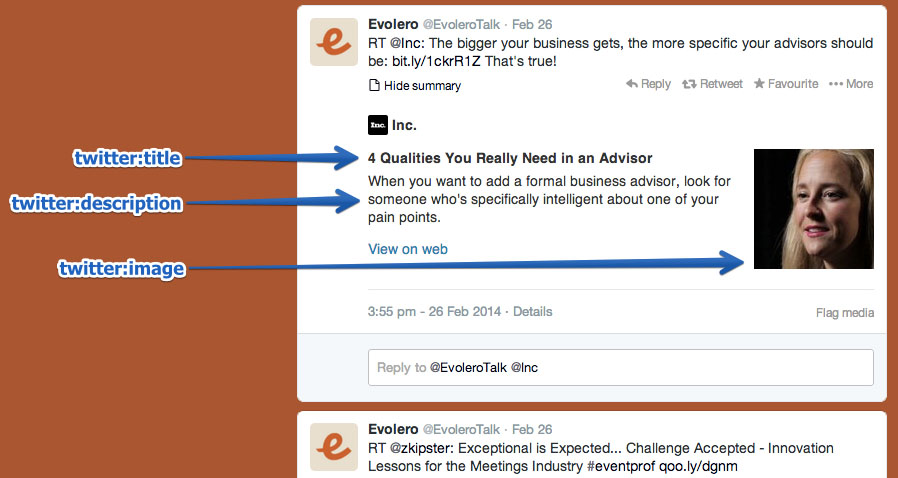

# HTML笔记

## 元素类别
HTML4及XHTML的元素分为__内联元素__和__块元素__。而HTML5的元素分类主要为7类:
* Metadata(元数据元素)
* Flow(流式元素)
* Sectioning(章节元素)
* Heading(标题元素)
* Phrasing(段落元素)
* Embedded(嵌入元素)
* Interactive(交互元素)

。这些分类集合存在一定的交集。
其关系如下：

1. Metadata(元数据元素-为描述数据的数据，主要是描述数据属性的信息）
Metadata元素指那些定义文档元数据信息的元素。其作用包括影响文档中其他节点的展现与行为、定义文档与其他外部资源之间的关系等。例
    
        base(为页面上所有的链接规定默认的地址或目标), link, meta, noscript, script, style, template, title

2. Flow(流式元素)
所有能放置在BODY标签内，构成文档内容的元素都属于Flow元素.meta、base等只能放置在HEAD标签内的不属于FLOW元素

3. Sectioning(章节元素)
章节元素指定义页面结构的元素，包含以下四个：

        article, aside, nav, section

4. Heading(标题元素)
所有标题的TAG属于Heading，即包含以下6个元素：

        h1, h2, h3, h4, h5, h6

5. Phrasing(段落元素)
所有可以放置在P标签内，构成段落内容的元素都属于Phrasing(一般HTML4的内联元素属于此类).
    //待定....

6. Embedded(嵌入元素)
所有用于嵌入外部资源的元素都属于Embedded元素，包含下列9个：

        audio, video, img, canvas, svg, iframe, embed, object, math

7. Interactive(交互元素)
所有与用户交互有关的元素都属于Interactive元素。

        a, audio(若设置了controls), button, details, embed, iframe, img(若设置了usemap), input, keygen, label, menu(若type为toolbar), object(若设置了usemap), select, textarea, video(若设置了controls)

8. Palpable(可知)
所有应该有子元素的元素称为Palpable元素。闭合元素都不属于此类。

9. Script-supporting
自身不做任何页面展示，仅与页面脚本相关的元素。包含如下3个：

        script, template, noscript

* _透明内容模型_：其子元素的合法性由其父元素决定，若其父元素的内容模型仍为透明，则查看其祖父元素的内容模型，直至BODY。

## OPEN GRAPH TAG
此类标签主要规定传递给第三方媒体社交网站的整体方案，使第三方社交网站可以正确识别使用资源。主要用途有：分享链接。

* FACEBOOK TAG：

        <meta property="og:title" content="Your eye-catching title here" />

* Twitter TAG

        <meta name="twitter:card" content="summary" />

参考资料：<https://blog.kissmetrics.com/open-graph-meta-tags/>

## PICTURE
\<picture>元素是一个容器，用来为内部\元素提供多样的source

    <picture>
        <source srcset="https://cloud.24ways.org/authors/jensimmons72.webp" type="image/webp">
        
    </picture>

### WebP --- 一种新的网络图片格式

