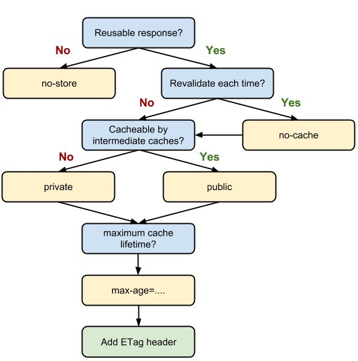

# OPTIMIZATION OF WEBSITE

## cache
请求查找咨询的顺序：Memory Cache -> Service Worker -> HTTP Cache -> Push "Cache"

### HTTP cache

  * no-cache/no-store/must-revalidate
  no-cache：使用缓存，但每一次使用缓存前**必须**向服务器发送缓存资源验证
  no-store：不使用任何缓存
  must-revalidate：可以配合max-age使用，当资源仍新鲜时使用缓存，否则需要对资源进行验证

  * max-age vs Expires
  max-age都是用于设置缓存的生命周期。不同Expires指定的是过期的具体时间，而max-age指定生命时长。
  Expires是HTTP/1.0中的标准，而max-age属于Cache-Control的内容。（Expires需要转换到用户的正确失去，否则可能出错）

  * Etag vs Last-Modified
  两者都可以用于对资源的验证，Etag属于强验证（资源字节级别的一致），Last-Modified属于弱验证（资源内容一致，页脚等可不一致）
  Etag验证过程：1.服务器第一返回给客户端的响应头中有一个Etag字段，这个字段代表这个请求的token（生成逻辑服务端决定，可以为md5码）。2.当资源过期后，客户端再次请求该资源时，请求头会添加一个字段If-None-Match，值为该资源的Etag。3.服务端根据Etag进行判断，若发生修改则返回完整资源（200状态码），否则返回304 Not Modified（304状态码）

  * max-age=0 vs no-cache
  max-age=0是**应该**对资源进行重新验证，非强制。no-cache是**必须**对资源进行重新验证，强制。no-cache保证浏览器在验证成功前绝不使用缓存资源

  * public vs private
  有些架构存在中间服务器或者使用专门的缓冲服务器。若请求的返回是用户级别的，需要将Cache-Control设置为private避免暴露给中间服务器。

整体HTTP Cache机制可以参考如下：
  

### Service Worker
Service Worker功能强大，除了能用作缓存，还可以用于离线、数据同步等。
关于Service Worker的缓存可以参考sw-precache，主要原理如下：
  
    self.addEventListener('install', event => {
      event.waitUntil(
        caches.open(`static-${version}`)
          .then(cache => cache.addAll([
            '/styles.css',
            '/script.js'
          ]))
      )
    })

    self.addEventListener('fetch', event => {
      event.respondWith(
        caches.match(event.request)
          .then(response => response || fetch(event.request))
      )
    })

  1. 网络请求先到达SW，未命中的话再进入HTTP缓存，所以install阶段的资源也是从HTTP缓存中获取。
  2. 为了在SW中摒弃HTTP缓存，可设置cache，若浏览器不支持cache设置则可加入md5等保证每次的请求URL不同
  3. 若要保证资源绕过HTTP Cache，则SW脚本必须知道所有的静态资源。根据静态资源编写脚本，这是一个可自动化的过程

      caches.open(`static-${version}`)
        .then(cache => cache.addAll([
          new Request('/styles.css', { cache: 'no-cache' }),
          new Request('/script.js', { cache, 'no-cache' })
        ]))

### Memory Cache
Memory Cache主要包含的是当前文档中已抓取到的资源，如已下载的样式、脚本、图片等。当用户关闭网页时，Memroy Cache的资源将被释放。

#### preloader
1. image preloader
2. css preloader

### Push "Cache"
Push "Cache"是session级别的；即使URL相同但位于不同的session中也不会发生匹配。
Push "Cache"存储时间短暂，在chromium中只有5分钟左右。

  * 几乎所有资源都能被推送缓存
  * no-cache和no-store也会被推送
  * 如果connection关闭，Push "Cache"释放
  * 多个页面可以使用同个HTTP/2 connection，即可以使用同个push cache。这个特定依赖于浏览器的实现（PS：出于性能考虑，部分浏览器对相同域名单不同tab标签的连接使用同一个HTTP/2连接）
  * push cache的内容只有被使用一次，即使用后被移除
  * 如果推送内容已存在，浏览器可能会放弃推送

